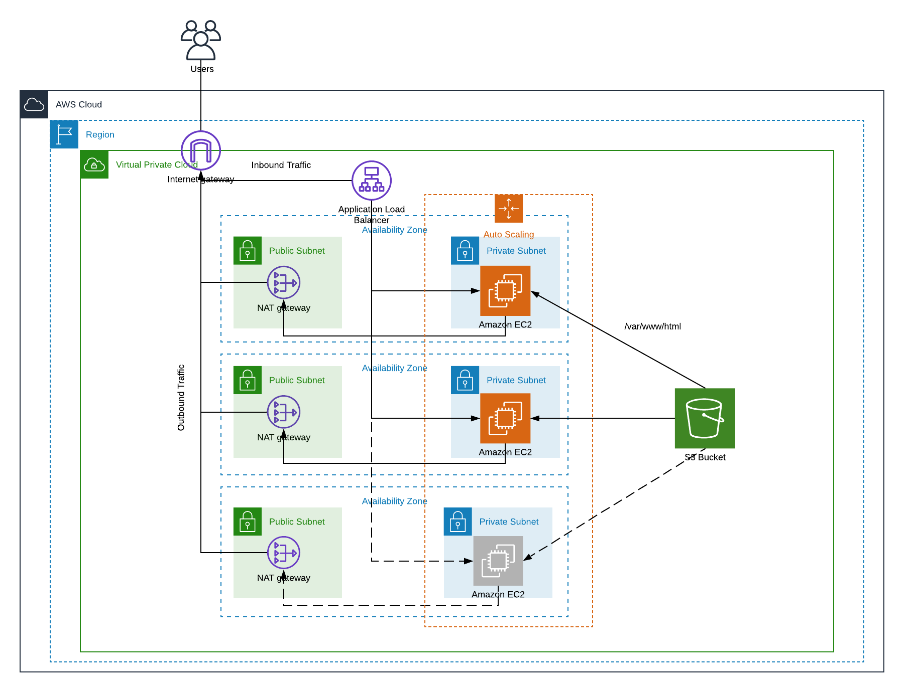

# ha-web-cf

### Deploy Highly Available Web Application template in AWS Cloudformation

Creates and deploys the infrastructure and serving web application with an sample instagram-like app from an S3 bucket. 

Deploying 

- vpc
- networking components
- launch configuration
- auto-scaling groups
- load balancer
- ec2 servers
- security roles
- software

